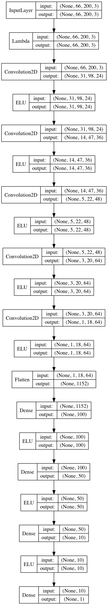
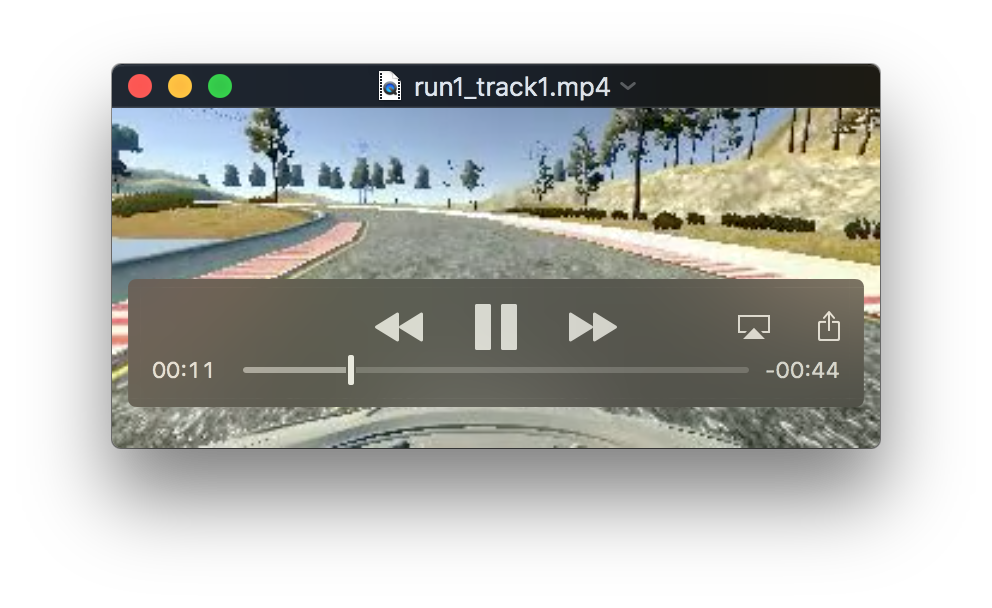
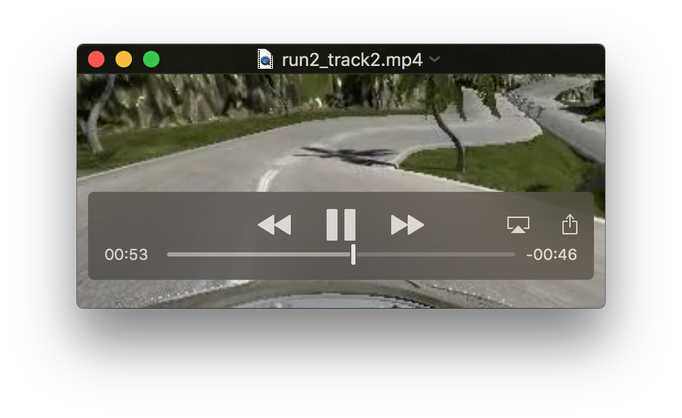

# Self Driving Car Engineer Nanodegree Project 3
## Behavioral Cloning

The goals / steps of this project are the following:

* Use the simulator to collect data of good driving behavior
* Build, a convolution neural network in Keras that predicts steering angles from images
* Train and validate the model with a training and validation set
* Test that the model successfully drives around track one without leaving the road
* Summarize the results with a written report


[//]: # (Image References)

[image1]: ./visualization/recordeddata_track1_only_drop0.jpg "Track 1 only no drop"
[image2]: ./visualization/recordeddata_track1_only_drop50.jp "Track 1 only dropping 50"
[image3]: ./visualization/AfterHistogramFlattening_track1_only_drop50 "Track histogram"
[image4]: ./visualization/recordeddata.jpg "Track 1 with lefts and rights"
[image5]: ./visualization/AfterHistogramFlattening_recordeddata.jpg "After histogram"
[image6]: ./visualization/model.jpg "Model"
[image7]: ./visualization/recordeddata_images_before.jpg "Images before"
[image8]: ./visualization/recordeddata_images_after.jpg "Images after"
[image9]: ./visualization/FlippedImagesAdded_recordeddata.jpg "Final for recordeddata"
[image10]: ./visualization/FlippedImagesAdded.jpg "Final for both tracks"


---
### Files Submitted
My project includes the following files:
* [proj3.py](./proj3.py) -- contains the script to create and train the model
* [drive.py](./drive.py) -- contains the script for driving the car in autonomous mode
* [modelbothtracks.h5](./modelbothtracks.h5) -- contains a trained convolutional neural network 

The car can be driven around either track by executing the following shell command:
```sh
python drive.py modelbothtracks.h5
```
The following command can be used to generate and train a new model:
```sh
python proj3.py --epochs=25 --datadirs=./recordeddata,./track1data --model=modelbothtracks.h5
```
The arguments that can be passed to proj3.py are as follows:

| Argument Name     | Description                                  | Default         | 
|:-----------------:|:--------------------------------------------:|:---------------:| 
| datadirs (d)      | A comma separated list of image directories  | ./recordeddata/ | 
| model (m)         | The name of the model file to create         | model.h5        |
| epochs (e)        | The number of epochs to use in training      | 20              | 
| generator (g)     | Whether a data generator is used             | True            |
| reloadmodel (l)   | Load and continue training an existing model | False           |
| droppercentage (p)| Percentage of small steering angles to drop  | 50              |
| visualization (v) | Generate plots and do not train              | False           | 

All arguments are optional. The following command line was used for training. 
```sh
python proj3.py --epochs=25 --datadirs=./recordeddata,./track2data --model=modelbothtracks.h5
```
The following is an example of a command line that can be used just to visualize the data. 
```sh
python proj3.py --datadirs=./recordeddata --visualization=true
```
When data is visualized, jpg images of the plots are both shown on the screen and written to the following directory: ./visualization. This directory must be created manually before running the script.

### Model Architecture and Training Strategy

I initially used the neural network architcture from the nVidia End to End Learning [paper](https://arxiv.org/pdf/1604.07316v1.pdf). I read this paper in its entirety prior to starting on the project. I figured that copying the architecture used by one of the leaders in the AV space was a sound starting point. Pursuant to this, my initial neural network architecture consisted of 5 convolutional layers with 5x5 filter sizes on the first 3 convolutional layers and 3x3 filter sizes on the last 2. The output of the convolutional layers was then flattened and fed to 4, fully-connected layers. The depths of the convolutional layers varied between 64 and 24 (see the function in model.py called build_model at lines 159-175). The model includes ELU layers to introduce nonlinearity. The input images are normalized using a lambda layer. The model summary showed there to be 252,219 trainable parameters. The architecture is shown below. 

<p align="center">

</p>

### Attempts to reduce overfitting in the model

The [nVidia paper](https://arxiv.org/pdf/1604.07316v1.pdf) was silent as to the steps that were taken to reduce overfitting, but building on the work from my [previous project](https://github.com/alangordon258/SelfDrivingCar-Term1-Proj2) on Traffic Sign Classification, I added a dropout layer between the convolutional and fully-connected layers to reduce overfitting (model.py lines 167). However, using this approach, I was still seeing substantial difference between the training and validation loss. An example of this was the values of 0.020 for training loss vs. 0.028 for validation loss. I used a split between training, validation, and test data of 80/10/10. I was using the Adam optimizer with the default learning rate of .001. Even though the training loss was low, the car was not driving well. I suspected that the network was overfitting. I therefore decided to augment the nVidia network with L2 regularization. See the function in model.py called build_model_with_regularization at lines 176-209).

I used a regularization parameter of .001.  I eventually settled on 25 after observing where the training loss stopped declining. It was taking more than 5 hours to train my network so I switched to using a GPU-enhanced, AWS EC2 instance. On this g2-2xlarge instance, it was taking about 20 minutes to train my network. With this change, I was seeing loses akin to .06 and there was an approximately 5 percent difference between the training and validation losses. So the network was training well. 

### Image Processing

The [nVidia paper](https://arxiv.org/pdf/1604.07316v1.pdf) recommended doing a YUV colorspace transformation of the data so I did this. I also cropped off the top 50 and bottom 20 pixels of each image as recommended by the project description. I also applied a slight blur to each image and resized it to 66x200 to match the input size used in the [nVidia paper](https://arxiv.org/pdf/1604.07316v1.pdf). I also edited drive.py to perform the same image processing steps prior to using each image to get a steering angle prediction. The final image processing step is to normalize the image to have mean 0 and a variance of 1. I implemented a lamda layer that applies the following scaling to each pixel of the image:

x/127.5 - 1.0

A set of left, right, and center images prior to image processing are shown below.
![alt text][image7]
The same images after processing are shown below
![alt text][image8]
### Training data

I decided to create my own training data from scratch without utilizing the data that was provided to us. I begun by driving two laps in the counter-clockwise direction. I trained with this data and the car did not drive well. it weaved quite a bit and was only able to follow the track as long as the turning radius was not very tight. I created a histogram of the data, which is shown below.
![alt text][image1]
Referring back to the [nVidia paper](https://arxiv.org/pdf/1604.07316v1.pdf), I remembered that it stated that recorded driving data tends to be biased towards driving straight. This was certainly true for the track 1 data that I had collected. Not only does a high portion of the data reflect small steering angles, there is also a heavy bias towards left turns. To correct these problems, I made two adjustments to my training: (1) On initial input, I dropped 50% of the small steering angles that are read from the data directory. I define a small steering angle to be any steering value that has an absolute value less than 0.05. I arrived at both the drop percentage and the 0.05 value through experimentation. (2) I used histogram flattening to smooth the distribution of my data (see the method called flatten_histogram in [proj3.py](./proj3.py)). I calculated a histogram of the data using bands of .1. I then determined the average number of measurements in each band. For any bands that contained more than the average number of measurements, I randomly dropped enough measurements to bring the number of measurements in that band down to the average.
Making both of these changes improved the distribution of the data, but substantially reduced the number of measurements. So, I did more driving including driving in the opposite direction and doing some recovery sequences, driving from the edge of the track to the center. After this, the distribution of my training set data looked as follows.
 ![alt text][image5]
This looked a lot better, but per the instructions for the project, I also decided to leverage the left and right images. I used a correction of 0.25. I added this correction to the steering value associated with each left image and subtracted it from the steering value associated with the right image. In addition, to further increase my data, I also leveraged horizontally flipped images by flipping the image using the numpy fliplr method and then taking the negative of the steering angle. This step doubled my data. This final step of flipping the images had to be deferred to the data generator, because the images are not loaded into memory until then. With all of these changes made, my final data distribution for track 1 looked as follows. I had a total of 24768 records in my training set and 6192 records in my validation set. 
![alt text][image9]
After training with this data, the car drove smoothly around track 1. See the video below. I increased the speed in drive.py from 9 to 12.
[](./run1_track1.mp4) 
I next wanted to see if the car would drive autonomously around the more challenging track (track 2). I wasn't surprised to see that it didn't even make it to the first turn. At this point I had not driven any training laps on track 2, so I decided to start by recording a couple of training laps. This turned out to be much harder than expected. I was unable to drive the track manually until I purchased a joystick and pedals. With this additional equipment, I was able to drive two smooth laps. I trained my network with this additional data. A histogram of this data is shown below. I now had a total of 37856 records in my training set and 9464 records in my validation set. 
![alt text][image10]
 I thought I would have to do significantly more work before the car would drive autonomously around this track, but I was pleasantly surprised to find that my car drove smoothly around the track in autonomous mode the first time that I tried it! See the video below.
 [](./run2_track2.mp4)
Interestingly in the [nVidia paper](https://arxiv.org/pdf/1604.07316v1.pdf) the researchers added: "artificial shifts and rotations to teach the network how to recover from a poor position or orientation. The magnitude of these perturbations is chosen randomly from a normal distribution". I thought that I would have to do this also, but since the car was driving well without it, and I had already missed enough family time working on this assignment, I decided to quit while I was ahead for now. But I will implement this improvement later.  